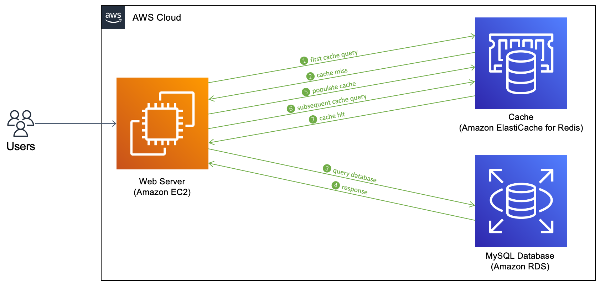

# Amazon Elasticache Demo

Java AWS CDK adaptation of [aws-samples/deploy-amazon-elasticache-for-redis](https://aws.amazon.com/fr/blogs/database/deploy-amazon-elasticache-for-redis-using-aws-cdk/).

## Useful commands

 * `mvn package`     compile and run tests
 * `cdk ls`          list all stacks in the app
 * `cdk synth`       emits the synthesized CloudFormation template
 * `cdk deploy`      deploy this stack to your default AWS account/region
 * `cdk diff`        compare deployed stack with current state
 * `cdk docs`        open CDK documentation

